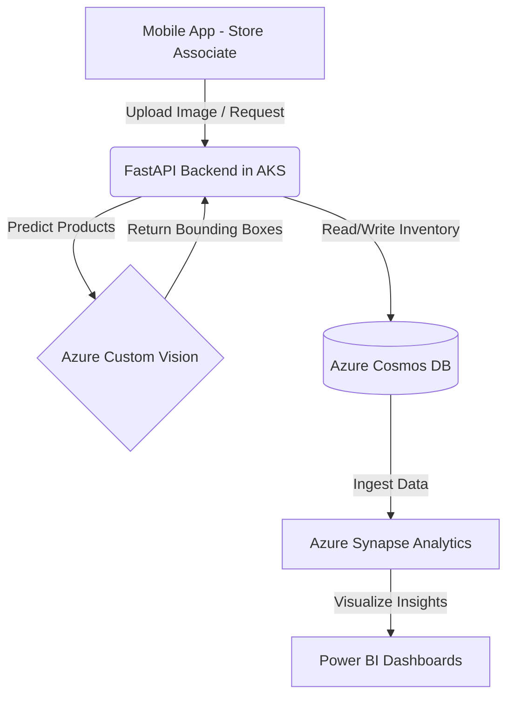

# Retail-Lens: AI-Powered Smart Shelf Assistant

**Retail-Lens** is a mobile application for retail store associates that uses the device's camera, powered by **Azure AI Vision**, to scan product shelves and provide real-time information on inventory status, price accuracy, and planogram compliance. This empowers employees to quickly identify and rectify issues like out-of-stock items, misplaced products, and incorrect price tags, ultimately improving store efficiency and customer satisfaction.

## 🚀 The Challenge & Opportunity
The primary challenge being addressed is the inefficiency and inaccuracy of manual in-store shelf management. Store associates spend a significant amount of time manually checking inventory levels, verifying prices, and ensuring products are in their designated spots, which is prone to human error.

**Retail-Lens** aims to:
- **Increase sales** by reducing out-of-stock instances and ensuring product availability.
- **Improve operational efficiency** by freeing up employee time for more value-added tasks like customer service.
- **Enhance customer experience** by ensuring products are easy to find and correctly priced.

## ✨ Why Retail-Lens? (Novelty & Benefits)
While some retailers use static cameras for shelf monitoring, **Retail-Lens** provides a flexible and cost-effective alternative by leveraging the mobile devices already in the hands of store associates.

- **Real-time Insights**: Immediate feedback on shelf status allows for quick corrective actions.
- **Improved Accuracy**: AI-powered image recognition is more accurate than manual checks.
- **Data-Driven Decisions**: Collects valuable data on product movement and shelf performance.
- **Ease of Use**: A simple, intuitive mobile interface requires minimal training for employees.

## 🏗️ Technical Architecture (Azure)



- **Frontend**: Mobile application built for Android/iOS.
- **Backend**: Microsoft Azure, using **Azure Kubernetes Service (AKS)** for scalable container orchestration.
- **AI/ML**: **Azure AI Vision (Custom Vision)** to train our object detection model on a custom dataset of the retailer's products.
- **Database**: **Azure Cosmos DB** for globally distributed, highly scalable data storage.
- **Data Analytics**: **Azure Synapse Analytics** and **Power BI** for rich, interactive dashboards.

## 🛡️ Responsible AI
We are committed to building Retail-Lens with Responsible AI principles in mind:
- **Security**: Data encryption and role-based access control via **Microsoft Entra ID**.
- **Fairness**: AI models trained on diverse datasets to avoid bias.
- **Privacy**: Faces and PII are blurred or ignored to protect the privacy of customers and employees.
- **Legal Compliance**: Compliant with GDPR, CCPA, and other relevant data protection regulations.

## 📈 Success Metrics
- Reduction in time spent by associates on manual shelf checks.
- Decrease in out-of-stock incidents.
- Increase in sales for key product categories.

## 🛠️ Setup & Development

### 1. Infrastructure (Terraform)
Navigate to the `infra/` folder to deploy Azure resources:
```bash
cd infra
terraform init
terraform plan
terraform apply
```

### 2. Backend API
The FastAPI backend is located in the `backend/` directory. To run it locally:
```bash
cd backend
pip install -r requirements.txt
uvicorn app.main:app --reload
```

### 3. MLOps Pipelines
The `mlops/` folder contains scripts for data preparation, model training (Azure Custom Vision), and evaluation. Check `mlops/README.md` for specific instructions.

### CI/CD
GitHub Actions are configured in `.github/workflows/` to automatically lint and deploy infrastructure upon push to the `main` branch.
